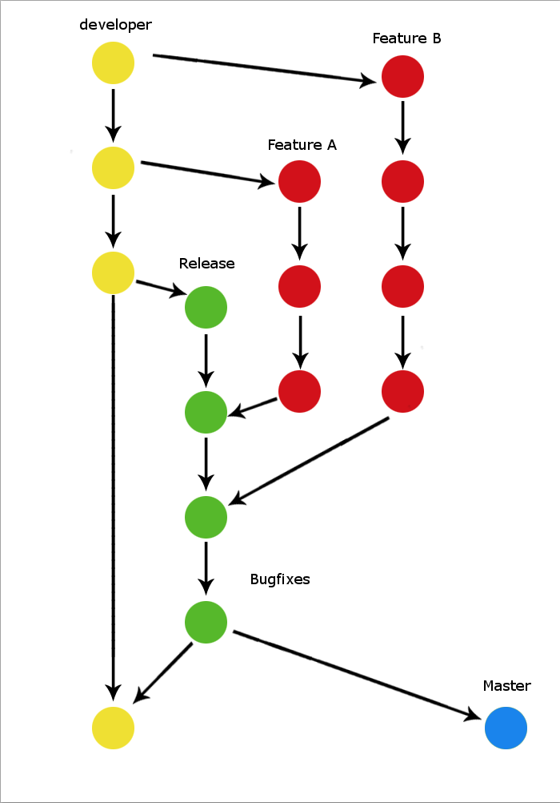

```{r setup, include=FALSE}
knitr::opts_chunk$set(echo = TRUE)
```

## Spatial data
 - GIS metadata: Coordinate systems, projections, z, ...?
 - Tools (to guess, to convert between projections)

## Version control
 - just an introduction?
 - more, in relation with the IT git class?
 - Emma's intro on Tools for collaboration
 - branching (master, devel)
 - pull requests
 - good practices
 - when to commit?

 - thinking of the possibility of having an hour breakout for students who are not familiar with git at all.  
 

Who? on what day? for how long?

## Workflow
 - The horror story
 - What to think about when planning a project?
 - of interest for all languages, don't be R specific before getting to the hands on.
 - never use Excel for data manipulation. (example of the date format nightmare and bad habits).
 - open access workflow examples. Don't feel embarrassed sharing your code!
 - when splitting your code into several scrips?
 - how to document? (R comments to function documentation, readme, DESCRIPTION)
 - how to document? (Rmarkdown)
 - Short illustration of make with drake.
 
 - part 1 preparing a rstudio notebook as an introduction. Using published bad open access data sets to illustrate vs. a great open access.
 - part 2 user's own data but having an example data set just in case. (we might be talking to students who have not be on the field yet / have no data yet)

Alban - 3-4 hours

## Introduction to database:
 - what is a relational database?
 - why?
 - Structure? fore reliability, for readability, reproducibility, archiving, FAIR, speed, weight

Who? on what day? for how long?  

## Introduction to iDiv data repository (Ani)
 - What is good open data metadata
 - Naming variables in a meaningful way
 - Open formats
 
Who? on what day? for how long?  

## FAIR principals and Open data (Emma)
- introduction to the fair principals
- sources of open data/ places to put your open data
- introduction to being open with the entire data synthesis process, wrangling, code, and data

## Data Examples (Emma)
- Lets find an open dataset and work with it
- one bad and one good example

## Horror Card Game
Ice-breaker:
A (~role playing) card game with lost/corrupted/unclear data set situations to explore and solve. Such as having to run analyses again the day before your defense and data is missing.  
Practical  
Social  
English and German  
Used to 'scare' them to make them realise how bad it can get  

  

  
